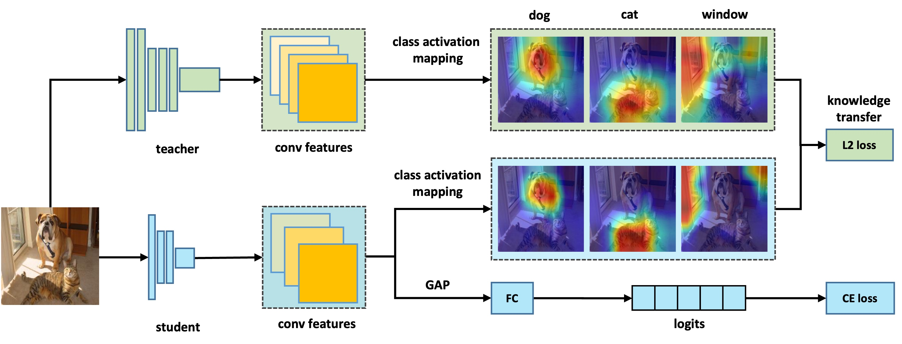

Our code is based on mdistiller for knowledge distillation (https://github.com/megvii-research/mdistiller.git), and Transformer-Explainability for explainability tests (https://github.com/hila-chefer/Transformer-Explainability.git).

# Explainability-based Knowledge Distillation

### Framework & Performance

<div style="text-align:center"></div>

### Main Benchmark Results

On CIFAR-100:


| Teacher <br> Student |ResNet56 <br> ResNet20|ResNet110 <br> ResNet32| ResNet32x4 <br> ResNet8x4| WRN-40-2 <br> WRN-16-2| WRN-40-2 <br> WRN-40-1 | VGG13 <br> VGG8|
|:---------------:|:-----------------:|:-----------------:|:-----------------:|:------------------:|:------------------:|:--------------------:|
| KD | 70.66 | 73.08 | 73.33 | 74.92 | 73.54 | 72.98 |
| **Exp-KD** | **71.77** | **74.13** | **77.36** | **76.27** | **74.77** | **74.85** |


| Teacher <br> Student |ResNet32x4 <br> ShuffleNet-V1|WRN-40-2 <br> ShuffleNet-V1| VGG13 <br> MobileNet-V2| ResNet50 <br> MobileNet-V2| ResNet32x4 <br> MobileNet-V2|
|:---------------:|:-----------------:|:-----------------:|:-----------------:|:------------------:|:------------------:|
| KD | 74.07 | 74.83 | 67.37 | 67.35 | 74.45 |
| **DKD** | **78.20** | **77.75** | **70.63** | **71.74** | **78.98** |
    

On ImageNet:

| Teacher <br> Student |ResNet34 <br> ResNet18|ResNet50 <br> MobileNet-V1|
|:---------------:|:-----------------:|:-----------------:|
| KD | 71.03 | 70.50 | 
| **DKD** | **71.74** | **72.43** |

# Exp-KD


### Installation

Environments:

- Python 3.6
- PyTorch 1.9.0
- torchvision 0.10.0

Install the package:

```
sudo pip3 install -r requirements.txt
sudo python3 setup.py develop
```

### Getting started

0. Wandb as the logger

- The registeration: <https://wandb.ai/home>.
- If you don't want wandb as your logger, set `CFG.LOG.WANDB` as `False` at `mdistiller/engine/cfg.py`.

1. Evaluation

- You can evaluate the performance of models trained by yourself.

- If test the models on ImageNet, please download the dataset at <https://image-net.org/> and put them to `./data/imagenet`

  ```bash
  # evaluate teachers
  python3 tools/eval.py -m resnet32x4 # resnet32x4 on cifar100
  python3 tools/eval.py -m ResNet34 -d imagenet # ResNet34 on imagenet
  
  # evaluate students
  python3 tools/eval.p -m resnet8x4 -c download_ckpts/dkd_resnet8x4 # dkd-resnet8x4 on cifar100
  python3 tools/eval.p -m MobileNetV1 -c download_ckpts/imgnet_dkd_mv1 -d imagenet # dkd-mv1 on imagenet
  python3 tools/eval.p -m model_name -c output/your_exp/student_best # your checkpoints
  ```


2. Training on CIFAR-100

- Download the `cifar_teachers.tar` at <https://github.com/megvii-research/mdistiller/releases/tag/checkpoints> and untar it to `./download_ckpts` via `tar xvf cifar_teachers.tar`.

  ```bash
  # for instance, our DKD method.
  python3 tools/train.py --cfg configs/cifar100/dkd/res32x4_res8x4.yaml

  # you can also change settings at command line
  python3 tools/train.py --cfg configs/cifar100/dkd/res32x4_res8x4.yaml SOLVER.BATCH_SIZE 128 SOLVER.LR 0.1
  ```

3. Training on ImageNet

- Download the dataset at <https://image-net.org/> and put them to `./data/imagenet`

  ```bash
  # for instance, our DKD method.
  python3 tools/train.py --cfg configs/imagenet/r34_r18/cam.yaml
  ```

4. Training on MS-COCO

- see [detection.md](detection/README.md)


5. Extension: Visualizations

- Jupyter notebooks: [tsne](tools/visualizations/tsne.ipynb) and [correlation_matrices](tools/visualizations/correlation.ipynb)


# License

MDistiller is released under the MIT license. See [LICENSE](LICENSE) for details.
